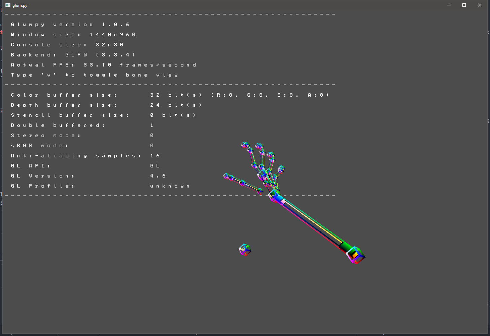
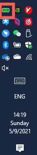
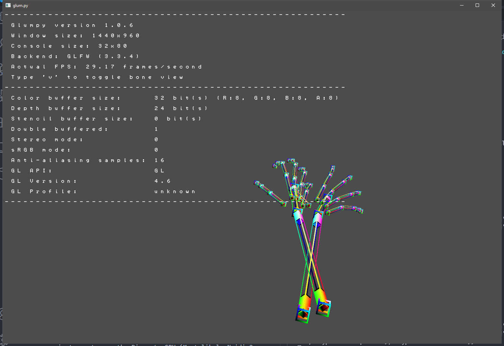
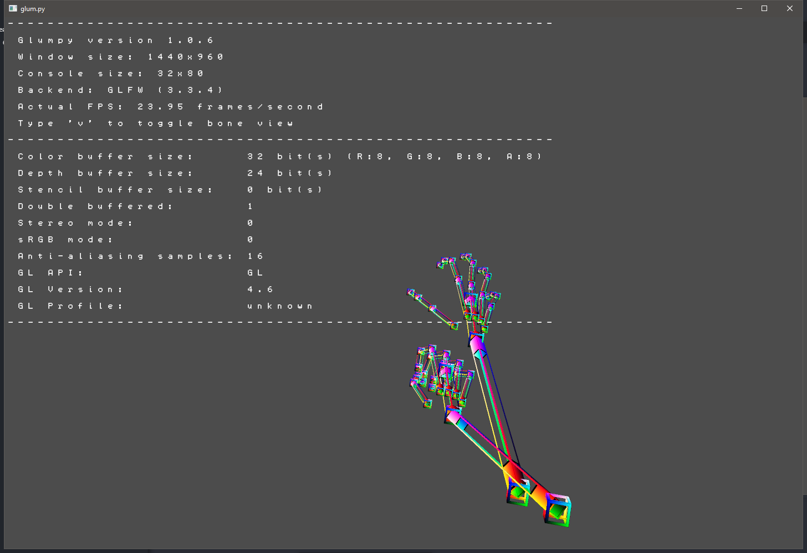

# Leap Motion Controller Python Driver



Based on `WebSocket`.

All python files except `glum.py` ARE NOT PART OF THE DRIVER, THEY'RE JUST FOR FUN.


## Quick Start

### Python Setup

First, you should have a `python 3` installation available, `conda` or just `python` with both work fine.

Then, install the required package listed in `requirements.txt` by:

```shell
pip install -r requirements.txt
```

For **Windows** user, the `glumpy` package need to be fixed to properly display fonts.

- Navigate to `<YOUR PYTHON ROOT>/lib/site-packages/glumpy/graphics/text/sdf_font.py`, line `45`
- Change both the `(ratio*ncols)` and `(ratio*nrows)` to `int(ratio*ncols)` and `int(ratio*nrows)`

For `python 3.8` or above, since `time.clock()` has been removed, you need to fix it in the `glumpy` installation.

- Navigate to `<YOUR PYTHON ROOT>/lib/site-packages/glumpy/app/clock.py`, line `164`.
- Change `time.clock` to `time.perf_counter`
- See this [issue](https://github.com/glumpy/glumpy/issues/254) for more information

### Leap Motion Setup

First you need to download the software development kit from **Leap Motion**'s [developer portal](https://developer.leapmotion.com/sdk-leap-motion-controller).

Then, buy a **Leap Motion Controller** and plug it in your system.

For your convenience, this is the [download link](https://www2.leapmotion.com/v4.1-lmc-windows-sdk) for the 4.1.0 **Windows** SDK.

- Install the SDK by double clicking the `.exe` file and click through

- After that if all went well you should see a green bar lying in your task bar (assume you're a **Windows** user)

  

- Click the green bar and you'll see some convenient information listed, some funny debugging tool. Play around if your like.

- Then, you need to check the **enable web app** checkbox in the settings or `glum.py` won't run.
  Since our driver is based on `WebSocket`

### Test `glum.py`

You can just run

```shell
python glum.py
```

to see whether everything is working now.

Raise your hand above the Leap Motion Controller, to see some fingers rendered





Typically, you might encounter these problems:

1. `Cannot connect to WebSocket`
   This is caused by invalid SDK `WebSocket` version or not enabling web app in the **Leap Motion Controller Panel**.
   Try changing the URI presented in the `sample` function of the `glum.py` file. Try out `v6.json` or `v7.json`

2. `Low Frame Rate`, typically, `glum.py` should be able to run close to 60 FPS (at least above 40) on a discrete GPU.
   This might be caused by not enabling your python instance to use the Discrete GPU (Most likely Nvidia?).
   Go to **Nvidia Control Panel**, navigate to 3D settings, change per app settings and add your `python` to the list, then select `High Performance Processor`.
   This might also be caused by not installing a **good backend** for `glumpy`, install `glfw` by the following [link](https://www.glfw.org/download)
   Check this [link](https://glumpy.readthedocs.io/en/latest/installation.html#backends-requirements) for more information and for a step-by-step 64-bit **Windows** installation guide.
